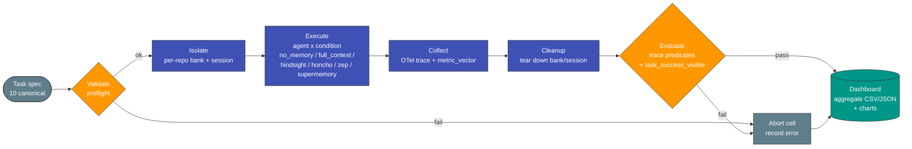

# MemSWE Benchmark Harness — Flow Diagram

Central flow for the MemSWE 240-cell matrix (10 canonical tasks x 6 conditions x 4 reps).
Verified by AGE-186: 240/240 `otel_trace_complete=pass`, `task_success_visible=1`.

## Stage legend

| Stage | What happens | Evidence key |
|-------|--------------|--------------|
| Validate | Local smoke / preflight per adapter | `error.failed_phase=preflight` on abort |
| Isolate | Fresh memory bank + graded session per cell | `condition.baseline_kind`, `bank_id` |
| Execute | Agent runs task under one memory condition | `session_results`, `run_id` |
| Collect | Emit OTel trace + `metric_vector` | `output_locations.trace_store_ref` |
| Cleanup | Tear down bank/session state | (idempotent teardown) |
| Evaluate | Trace predicates + visible success | `trace_predicate_results[otel_trace_complete]` |
| Dashboard | Aggregate to CSV/JSON + charts | this directory |
